# CrimeNet AI — Frontend Plan & Collision-Free Timeline

> **For Frontend Developer (React)**  
> **Collaborator**: Backend Developer (RAG & Agentic Engine)  
> **Goal**: Build a modern, high-impact investigative UI for Indian Law Enforcement in React without getting blocked by or colliding with backend development.

---

## 1. Zero-Collision Golden Rules

To ensure both of you can code 100% in parallel with **zero merge conflicts**:

1. **Folder Boundary Isolation**:
   - **YOUR WORKSPACE**: Everything inside `frontend/` directory.
   - **TEAMMATE'S WORKSPACE**: Everything inside `backend/`, `analyzer/`, `storage/`.
   - Never edit files outside your directory without coordination.
2. **Branching Strategy**:
   - Your branch: `feature/react-frontend`
   - Teammate's branch: `feature/agentic-rag-backend`
   - Merge target: `big-updates`
3. **Mock-First Architecture (`USE_MOCK = true`)**:
   - You **do not wait** for the backend to be built.
   - You build every UI component using a bundled `mockData.ts` / `mockData.json` file.
   - When the backend is ready, you flip a single flag: `const USE_MOCK = false;` in your API client!

---

## 2. Recommended Tech Stack

| Layer | Recommended Library | Why |
|---|---|---|
| **Build Tool** | `Vite` (React + TypeScript) | Instant HMR, lightning-fast setup. |
| **Styling** | `Tailwind CSS` | Rapid dark-mode cyber-forensic styling. |
| **Icons** | `lucide-react` | Clean, modern investigative & security icons. |
| **Graph Canvas** | `cytoscape` + `react-cytoscapejs` *OR* `@xyflow/react` | Hardware-accelerated interactive graph layout. |
| **Report / PDF** | Native `@media print` CSS *or* `jspdf` | Instant one-click PDF generation without backend lag. |
| **HTTP Client** | `axios` | Configurable base URL with interceptors. |

---

## 3. Synchronized 24-Hour Timeline

```mermaid
gantt
    title CrimeNet Full-Stack Parallel Timeline
    dateFormat HH:mm
    axisFormat %H:%M

    section Teammate (React UI)
    Vite + Tailwind Setup & Project Shell      :00:00, 2h
    Cases Dashboard & Navigation Tabs          :02:00, 3h
    Interactive Graph Canvas & Filtering       :05:00, 4h
    Entity Dossier Drawer & Quick Actions      :09:00, 3h
    Chronological Timeline & Alert Center      :12:00, 4h
    Briefing Report & PDF Export View          :16:00, 2h
    Flip to Live API & End-to-End Polish       :18:00, 4h
    Dry Run Pitch Walkthrough                  :22:00, 2h

    section You (RAG & Agentic Backend)
    FastAPI Shell & In-Memory ActiveNetwork    :00:00, 2h
    Regex Parser + LLM Narrative NER Extractor :02:00, 4h
    Follow-the-Money 3-Hop Tracing Engine      :06:00, 3h
    Evidence Document RAG & Vector Chunks      :09:00, 4h
    Agentic Dossier Synthesizer & Recommendations:13:00, 3h
    @feedback Skill & Immutable Audit Ledger   :16:00, 2h
    Connect Live Endpoints with Frontend       :18:00, 4h
    Final Verification & Bug Bash              :22:00, 2h
```



### Detailed Phase Breakdown

#### ⏱️ Phase 1: Setup & Project Scaffolding (Hours 0 – 2)
- **Action**: In project root, run:
  ```bash
  npm create vite@latest frontend -- --template react-ts
  cd frontend
  npm install
  npm install -D tailwindcss postcss autoprefixer
  npx tailwindcss init -p
  npm install lucide-react axios cytoscape react-cytoscapejs clsx tailwind-merge
  ```
- Configure Tailwind dark theme (`slate-950` dark background, `emerald-500` safe, `rose-500` critical, `amber-500` warning).
- Create `src/api/mockData.ts` using the schemas in Section 5 below.

#### ⏱️ Phase 2: Navigation Shell & Cases Dashboard (Hours 2 – 5)
- Header with CrimeNet branding (`CrimeNet AI // Indian LEA Edition`).
- Top View Navigation Bar:
  - 📁 **Cases Dashboard**
  - 🕸️ **Network Map**
  - ⏱️ **Timeline View**
  - 🚨 **Threat Alerts**
  - 📄 **Briefing Dossier**
- **Cases Dashboard View**:
  - Grid of investigative case cards (Title, Crime Type, Suspect count, Risk badge).
  - Filter pills (`All`, `Critical`, `Ongoing`, `Cold`).
  - `+ Register New Case` button opening a modal form.

#### ⏱️ Phase 3: Interactive Graph Canvas & Tactical Command Bar (Hours 5 – 9)
- **Top Command Bar**:
  - Narrative input: *"Paste suspect narrative, FIR facts, or enter `@feedback ...`"*
  - Buttons: `[+ Attach Evidence Files]`, `[Run AI Analysis]`.
  - Loading spinner with state: *"Cross-referencing database & extracting entities..."*
- **Graph Canvas**:
  - Render color-coded nodes:
    - 🔴 **Person / Suspect**: `#f43f5e` (Rose)
    - 🟡 **Phone**: `#f59e0b` (Amber)
    - 🟢 **Bank / UPI Account**: `#10b981` (Emerald)
    - 🔵 **Shell Company / Org**: `#3b82f6` (Blue)
    - 🟣 **Vehicle**: `#a855f7` (Purple)
    - 🩵 **Location**: `#06b6d4` (Cyan)
  - Edge styles: Solid for verified contacts, dashed for predicted links, green arrows for fund transfers with amount labels.
  - Category filter pills on top-right of canvas (`Toggle Persons`, `Toggle Accounts`, etc.).

#### ⏱️ Phase 4: Entity Dossier Drawer & Quick Actions (Hours 9 – 12)
- Clicking any node opens the right slide-out **Dossier Drawer**:
  - **Header**: Entity Name, Badge, Threat Score meter (0–100%).
  - **Tab 1: AI Dossier**: Plain English identity summary, key associations, sources cited.
  - **Tab 2: Connections**: Table of immediate neighbors, relationship types, and call/transaction counts.
  - **Tab 3: Evidence Sources**: Quotes and references to FIR documents.
  - **Quick Police Action Dispatchers**:
    - 🚨 `Issue LOC (Lookout Circular)`
    - ❄️ `Freeze Account (Sec 102 CrPC)`
    - 📄 `Summons (Sec 35(3) BNSS)`
  - Dispatching shows toast notification: *"Action Dispatched & Logged to Immutable Audit Trail"*.

#### ⏱️ Phase 5: Timeline View, Threat Alerts & Follow-the-Money (Hours 12 – 16)
- **Timeline View**:
  - Chronological vertical card feed (Transactions, Calls, FIR filed, Border sightings).
  - Filter by date range and entity.
- **Threat Alerts Panel**:
  - Feed of critical signals (e.g. *"Mule account burst: 15L dispersed to 4 accounts in 8 mins"*).
  - 1-click action button on each alert card.
- **Follow-the-Money Mode**:
  - Button on Bank Account node: `[Follow the Money]`.
  - Highlights the 3-hop money path in neon emerald on the canvas, dimming non-financial nodes.

#### ⏱️ Phase 6: Report Generation & Printable PDF (Hours 16 – 18)
- **Briefing Report View**:
  - Official format: Case Overview, Executive Summary, Suspect Hierarchy, Financial Trail Breakdown, Action Audit Log.
  - Clean `@media print` styles.
  - `[Download / Print PDF]` button calling `window.print()`.

#### ⏱️ Phase 7: Live API Handshake & Final Polish (Hours 18 – 22)
- In `src/api/client.ts`, change `USE_MOCK = false`.
- Test real live requests against teammate's FastAPI server (`http://localhost:8000`).
- Test `@feedback` live command: type `@feedback E2 is victim` $\rightarrow$ verify node color updates live!

#### ⏱️ Phase 8: Pitch Rehearsal (Hours 22 – 24)
- Follow the pitch script:
  1. Open dashboard $\rightarrow$ Select Critical case.
  2. Paste narrative $\rightarrow$ Watch graph build automatically.
  3. Click key suspect $\rightarrow$ Show Plain English dossier.
  4. Click bank account $\rightarrow$ Trace money 3 hops.
  5. Dispatch LOC $\rightarrow$ Switch to Timeline $\rightarrow$ Show Audit log.
  6. Type `@feedback` $\rightarrow$ Watch AI learn from human ground truth.
  7. Generate and print Prosecutor Report.

---

## 4. Frontend Component Hierarchy

```
frontend/src/
├── api/
│   ├── client.ts             # Axios client with USE_MOCK toggle
│   ├── mockData.ts           # Complete offline mock dataset
│   └── types.ts              # TypeScript interfaces for nodes, cases, alerts
├── components/
│   ├── layout/
│   │   ├── Navbar.tsx        # Top brand bar + view switcher
│   │   └── CommandBar.tsx    # Narrative input + file upload + @feedback
│   ├── canvas/
│   │   ├── NetworkCanvas.tsx # Cytoscape / React Flow wrapper
│   │   ├── CanvasControls.tsx# Zoom, Reset, Layout toggle (Force vs Hierarchical)
│   │   └── FilterPills.tsx   # Entity type visibility filters
│   ├── dossier/
│   │   ├── DossierDrawer.tsx # Slide-out entity intelligence panel
│   │   ├── ActionButtons.tsx # LOC, Freeze Account, Summons triggers
│   │   └── SourceCitations.tsx# Verified evidence references
│   ├── timeline/
│   │   └── TimelineFeed.tsx  # Chronological event sequence
│   ├── alerts/
│   │   └── AlertCenter.tsx   # Real-time threat signal feed
│   ├── cases/
│   │   ├── CasesGrid.tsx     # Multi-case cards
│   │   └── NewCaseModal.tsx  # Register case form
│   └── report/
│       └── BriefingReport.tsx# Printable prosecutor briefing
├── App.tsx                   # Main state & view router
└── main.tsx                  # React entry point
```

---

## 5. Plug-and-Play Mock Data (`mockData.ts`)

Copy-paste this directly into `frontend/src/api/mockData.ts` to build your UI immediately:

```typescript
export interface EntityNode {
  id: string;
  label: string;
  type: 'PERSON' | 'PHONE' | 'ACCOUNT' | 'ORGANIZATION' | 'VEHICLE' | 'LOCATION';
  threatLevel: 'LOW' | 'MEDIUM' | 'HIGH' | 'CRITICAL';
  threatScore: number;
  metadata?: Record<string, any>;
}

export interface EntityEdge {
  id: string;
  source: string;
  target: string;
  type: string;
  label: string;
  confidence?: number;
  amount?: string;
}

export const MOCK_GRAPH = {
  nodes: [
    { id: 'E1', label: 'Vikram Malhotra', type: 'PERSON', threatLevel: 'CRITICAL', threatScore: 0.95 },
    { id: 'E2', label: '98765-43210', type: 'PHONE', threatLevel: 'HIGH', threatScore: 0.82 },
    { id: 'E3', label: 'vikram@okhdfcbank', type: 'ACCOUNT', threatLevel: 'CRITICAL', threatScore: 0.91 },
    { id: 'E4', label: 'SBI-Mule-40912', type: 'ACCOUNT', threatLevel: 'CRITICAL', threatScore: 0.88 },
    { id: 'E5', label: 'Apex Global Logistics Ltd', type: 'ORGANIZATION', threatLevel: 'HIGH', threatScore: 0.79 },
    { id: 'E6', label: 'BVI Offshore Vault 99', type: 'ORGANIZATION', threatLevel: 'CRITICAL', threatScore: 0.96 },
    { id: 'E7', label: 'Surat Cargo Yard', type: 'LOCATION', threatLevel: 'MEDIUM', threatScore: 0.45 },
    { id: 'E8', label: 'MH-04-AB-9901 (Fortuner)', type: 'VEHICLE', threatLevel: 'HIGH', threatScore: 0.72 },
  ],
  edges: [
    { id: 'R1', source: 'E1', target: 'E2', type: 'USES_PHONE', label: 'Primary Contact' },
    { id: 'R2', source: 'E1', target: 'E3', type: 'OPERATES_ACCOUNT', label: 'Registered UPI' },
    { id: 'R3', source: 'E3', target: 'E4', type: 'TRANSFERRED_FUNDS', label: '₹15,00,000 (UPI)', amount: '₹15,00,000' },
    { id: 'R4', source: 'E4', target: 'E5', type: 'TRANSFERRED_FUNDS', label: '₹42,00,000 (RTGS)', amount: '₹42,00,000' },
    { id: 'R5', source: 'E5', target: 'E6', type: 'WIRE_TRANSFER', label: '₹85,00,000 (Offshore)', amount: '₹85,00,000' },
    { id: 'R6', source: 'E1', target: 'E8', type: 'SPOTTED_IN', label: 'Toll Plaza Footage' },
    { id: 'R7', source: 'E8', target: 'E7', type: 'VISITED', label: 'Geofence Hit' },
  ]
};

export const MOCK_DOSSIER: Record<string, any> = {
  E1: {
    nodeId: 'E1',
    name: 'Vikram Malhotra',
    type: 'PERSON',
    threatLevel: 'CRITICAL',
    threatScore: 0.95,
    summary: 'Identified as the syndicate ringleader orchestrating cross-border illegal cyber betting, extortion, and funneling proceeds via shell accounts.',
    connectionsSummary: 'Directly controls 1 primary UPI handle, linked to 1 luxury vehicle, associated with 3 layering entities.',
    recommendedActions: [
      { id: 'LOC', title: 'Issue Immediate Lookout Circular (LOC)', authority: 'Bureau of Immigration' },
      { id: 'FREEZE', title: 'Freeze Linked Banking Accounts', section: 'Sec 102 CrPC / Sec 106 BNSS' },
      { id: 'SUMMONS', title: 'Issue Interrogation Summons', section: 'Sec 35(3) BNSS' }
    ],
    sources: [
      { doc: 'FIR_2024_CYBER_88.pdf', citation: 'Page 3, Para 2: Suspect designated as primary beneficiary' },
      { doc: 'CDR_Analysis_March.csv', citation: '14 encrypted communications with Surat Logistics contact' }
    ]
  }
};

export const MOCK_ALERTS = [
  {
    id: 'ALT-101',
    severity: 'CRITICAL',
    title: 'Rapid Layering Transfer Flagged',
    timestamp: '10 mins ago',
    description: '₹15,00,000 dispersed from vikram@okhdfcbank to SBI-Mule-40912, followed by immediate wire to Apex Global Logistics.',
    actionLabel: 'Freeze Mule Account'
  },
  {
    id: 'ALT-102',
    severity: 'HIGH',
    title: 'Border Transit Warning',
    timestamp: '42 mins ago',
    description: 'Vehicle MH-04-AB-9901 registered to Vikram Malhotra passed through Vapi Toll Plaza towards international container port.',
    actionLabel: 'Dispatch Highway Patrol'
  }
];

export const MOCK_TIMELINE = [
  { time: '2024-03-10 09:15 AM', type: 'FIR', title: 'FIR #88 Registered', desc: 'Victim reports fraudulent extortion call demanding 20 Lakhs.' },
  { time: '2024-03-10 11:30 AM', type: 'TRANSACTION', title: 'UPI Transfer', desc: '₹15,00,000 transferred to vikram@okhdfcbank.' },
  { time: '2024-03-10 11:42 AM', type: 'TRANSACTION', title: 'Mule Account Burst', desc: '₹15,00,000 forwarded to SBI-Mule-40912 in Surat.' },
  { time: '2024-03-11 02:20 PM', type: 'VEHICLE', title: 'Toll Camera Hit', desc: 'Fortuner MH-04-AB-9901 spotted at Surat Cargo Yard.' },
  { time: '2024-03-12 04:00 PM', type: 'WIRE', title: 'Offshore Routing', desc: 'Apex Logistics initiates ₹85,00,000 wire to BVI Offshore Vault.' }
];

export const MOCK_CASES = [
  { id: 'CASE-2024-MH-088', title: 'Operation Golden Web', type: 'Organized Cyber Extortion', status: 'CRITICAL', suspects: 8, volume: '₹2.4 Cr' },
  { id: 'CASE-2024-DL-012', title: 'NCR Hawala Network', type: 'Financial Money Laundering', status: 'ONGOING', suspects: 14, volume: '₹18.6 Cr' },
  { id: 'CASE-2023-GJ-901', title: 'Surat Cargo Smuggling Cell', type: 'Narcotics & Logistics', status: 'COLD', suspects: 5, volume: '₹4.1 Cr' }
];
```

---

## 6. How to Connect to Live Backend (`client.ts`)

Create `src/api/client.ts`:

```typescript
import axios from 'axios';
import { MOCK_GRAPH, MOCK_DOSSIER, MOCK_ALERTS, MOCK_TIMELINE, MOCK_CASES } from './mockData';

// FLIP THIS TO FALSE WHEN YOUR TEAMMATE'S BACKEND IS RUNNING
export const USE_MOCK = true;

const apiClient = axios.create({
  baseURL: 'http://localhost:8000/api',
  timeout: 10000,
});

export const api = {
  getGraph: async (caseId: string) => {
    if (USE_MOCK) return MOCK_GRAPH;
    const res = await apiClient.get(`/graph/${caseId}`);
    return res.data;
  },

  submitNarrative: async (caseId: string, narrative: string) => {
    if (USE_MOCK) {
      // Simulates adding a new entity
      return {
        ...MOCK_GRAPH,
        nodes: [...MOCK_GRAPH.nodes, { id: 'E9', label: 'New Lead', type: 'PERSON', threatLevel: 'HIGH', threatScore: 0.75 }]
      };
    }
    const res = await apiClient.post('/investigate/narrative', { case_id: caseId, narrative });
    return res.data.graph;
  },

  getDossier: async (nodeId: string) => {
    if (USE_MOCK) return MOCK_DOSSIER[nodeId] || MOCK_DOSSIER['E1'];
    const res = await apiClient.get(`/entity/${nodeId}/dossier`);
    return res.data;
  },

  getAlerts: async () => {
    if (USE_MOCK) return MOCK_ALERTS;
    const res = await apiClient.get('/alerts');
    return res.data;
  },

  getTimeline: async (caseId: string) => {
    if (USE_MOCK) return MOCK_TIMELINE;
    const res = await apiClient.get(`/cases/${caseId}/timeline`);
    return res.data;
  },

  getCases: async () => {
    if (USE_MOCK) return MOCK_CASES;
    const res = await apiClient.get('/cases');
    return res.data;
  },

  submitFeedback: async (caseId: string, feedbackPrompt: string) => {
    if (USE_MOCK) {
      return { status: 'applied', message: 'Feedback applied locally (mock).' };
    }
    const res = await apiClient.post('/feedback', { case_id: caseId, feedback_prompt: feedbackPrompt });
    return res.data;
  },

  dispatchAction: async (actionId: string, entityId: string) => {
    if (USE_MOCK) {
      return { status: 'dispatched', actionId, entityId, timestamp: new Date().toISOString() };
    }
    const res = await apiClient.post('/actions/dispatch', { action_id: actionId, entity_id: entityId });
    return res.data;
  }
};
```

---

## 7. Delivery Checklist for Demo Day

- [ ] Can type suspect text in command bar $\rightarrow$ new nodes appear in real time.
- [ ] Clicking any node reveals the Plain English AI Dossier drawer.
- [ ] Clicking **"Follow the Money"** lights up the 3-hop transaction path in emerald.
- [ ] Threat Alerts tab displays real-time signals with 1-click **"Issue LOC"** or **"Freeze Account"** buttons.
- [ ] Timeline tab renders sequential investigation events.
- [ ] Typing `@feedback <text>` updates the graph and displays audit confirmation toast.
- [ ] **"Download / Print Official Briefing"** generates a clean prosecutor-ready PDF document.
