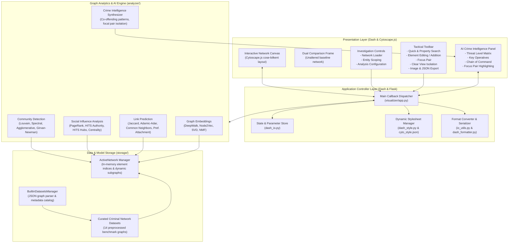
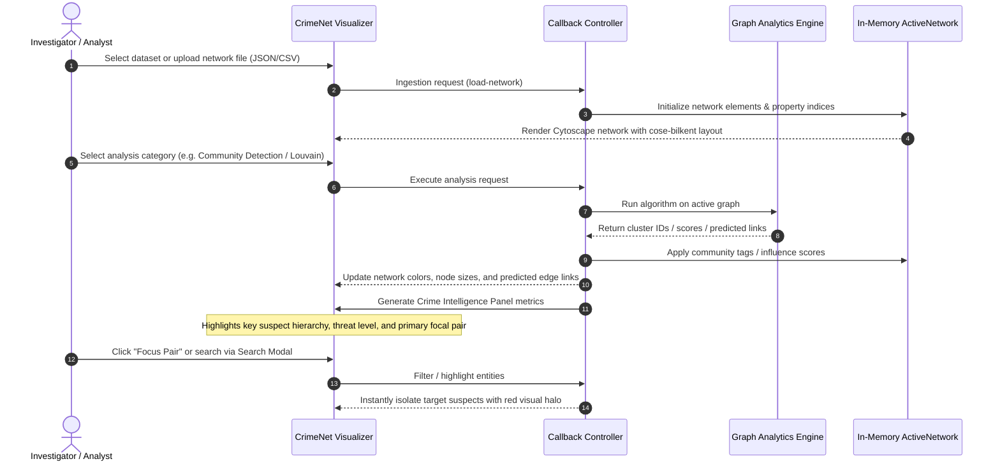
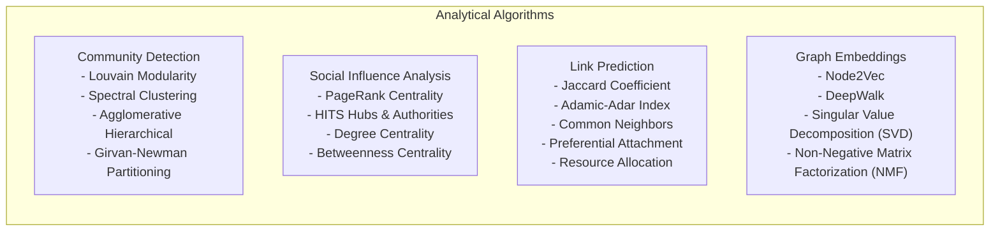
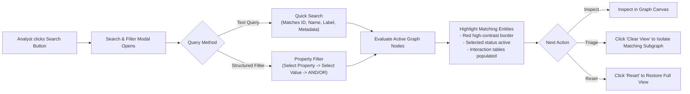

# CrimeNet — Criminal Network Analysis & Intelligence Platform

> **Current deployable prototype:** FastAPI + React/Vite investigator command center.
> The legacy Dash visualizer and its older dependency instructions remain in the
> repository for historical/reference use, but they are not the Render deployment
> described in [`DEPLOYMENT.md`](./DEPLOYMENT.md).
>
> **Quick start for the current prototype:**
>
> ```powershell
> python -m pip install -r backend/requirements.txt
> npm --prefix frontend install
> python -m uvicorn backend.main:app --host 127.0.0.1 --port 8000 --reload
> ```
>
> In a second terminal:
>
> ```powershell
> npm --prefix frontend run dev -- --host 127.0.0.1 --port 5173
> ```

[](https://www.python.org/)
[](https://dash.plotly.com/)
[](https://networkx.org/)
[](https://flask.palletsprojects.com/)
[](LICENSE)


---

## Executive Overview

**CrimeNet** is an interactive, investigative graph analytics and visualization platform designed for law enforcement, intelligence analysts, and academic researchers. It combines graph algorithms with interactive network visualization, automated forensic analysis, and an AI Crime Intelligence Engine.

CrimeNet operates completely in-memory with local execution, requiring no external databases or cloud services for core operations. It ships with 14 curated criminal network benchmark datasets ready for immediate exploration.

---

## System Architecture

The following diagram illustrates the architecture of the CrimeNet platform, outlining the data flow from ingestion through algorithmic processing, interactive rendering, and intelligence synthesis:



---

## Investigation Workflow

The end-to-end analytical lifecycle within CrimeNet follows a structured operational workflow:



---

## Core Capabilities

### 1. Interactive Graph Visualization
- **Physics-Based Layout**: Powered by Cytoscape.js with the `cose-bilkent` compound spring embedder algorithm for optimal cluster separation.
- **Dynamic Inspection**: Mouseover and click-to-select interactions for both nodes and edges with an active property inspection drawer.
- **Dual Network Comparison**: Expand an unaltered baseline frame side-by-side with the active investigation graph to track modifications, exclusions, and algorithm results.
- **Probability Thresholding**: Real-time edge probability slider for weighted networks to filter out low-confidence associations.


### 2. Graph Analytics Engine



- **Community Detection**: Groups criminal actors into operational cells and sub-gangs using modularity and spectral methods, visually color-coding clusters.
- **Social Influence Analysis**: Ranks criminal ringleaders and brokers; dynamically resizes node dimensions based on calculated centrality authority scores.
- **Link Prediction**: Discovers hidden or future criminal connections between suspects using topological proximity heuristics.
- **Node Embeddings**: Generates low-dimensional vector representations of network nodes for downstream classification and anomaly detection.


### 3. Search & Filter System

The Search & Filter system enables rapid tactical querying across large criminal graphs:



- **Quick Search**: Search across suspect names, aliases, phone numbers, or node identifiers instantly.
- **Multi-Property Filtering**: Chain up to 10 criteria rows combining specific properties (`affiliation`, `ethnicity`, `role`, `territory`, etc.) with `AND` and `OR` logical operators.
- **Tactical Actions**: Matched nodes are highlighted with high-contrast borders and automatically selected for follow-up actions like "Clear View" (subgraph isolation), "Exclude Elements", or "Edit Element".

### 4. AI Crime Intelligence

CrimeNet includes automated intelligence extraction:
- **Threat Level Assessment**: Aggregates network density, component connectivity, and centrality scores into an operational risk indicator.
- **Key Suspect Identification**: Identifies the primary command nodes, brokers, and logistics intermediaries in the network.
- **Chain of Command Extraction**: Derives hierarchical relationships based on directional flow and hub-authority scores.
- **Focus Pair Highlighting**: Identifies the most critical suspect pair in the active network and highlights them with one click.

---

## Repository Structure

```
CrimeNet/
├── visualizer/                     # Web Application Layer
│   ├── index.py                    # Server entrypoint and route management
│   ├── app.py                      # Dash application, main callback dispatcher, Flask routes
│   ├── dash_layout.py              # Visualizer UI layout and modal definitions
│   ├── dash_formatter.py           # UI components, tables, and dialog formatters
│   ├── dash_style.py               # Cytoscape stylesheet builder and visual encoders
│   ├── dash_io.py                  # Input, Output, and State declarations
│   ├── io_utils.py                 # Graph format conversion utilities
│   └── assets/                     # Stylesheets, SVG icons, and Cytoscape presets
│
├── analyzer/                       # Graph Analytics & AI Engine
│   ├── community_detection.py      # Community detection algorithms
│   ├── social_influence_analysis.py# Influence, PageRank, and centrality algorithms
│   ├── link_prediction.py          # Link prediction heuristics
│   ├── node_embedding.py           # Dimensionality reduction and embedding routines
│   ├── request_taker.py            # Analysis dispatch interface and metadata registry
│   ├── common/                     # Mathematical helpers and graph utilities
│   └── ge/                         # Graph embedding models (Node2Vec, DeepWalk)
│
├── storage/                        # In-Memory Graph Storage
│   ├── builtin_datasets.py         # ActiveNetwork and BuiltinDatasetsManager
│   ├── helpers.py                  # Graph integrity validators and query helpers
│   └── toy_datasets/               # Benchmark toy graph loaders
│
├── framework/                      # Interfaces and Base Contracts
│   ├── interfaces.py               # Abstract analyzer and visualizer interfaces
│   └── api_interface.py            # API contract definitions
│
├── conductor/                      # Optional Asynchronous REST API Layer
│   ├── src/                        # Flask and Celery task execution endpoints
│   └── settings.yaml               # Service configuration
│
├── datasets/
│   └── preprocessed/               # 14 criminal network benchmark datasets (JSON)
│
├── tests/                          # Automated unit and regression test suite
├── tester/                         # Component verification and integration scripts
├── requirements.txt                # Dependency specifications
├── LICENSE                         # MIT License
└── README.md                       # Platform documentation
```

---

## Included Datasets

CrimeNet includes 14 curated criminal network datasets spanning multiple investigative domains:

| Dataset ID | Name | Nodes | Edges | Network Domain |
|---|---|---|---|---|
| `montreal_gangs` | Montreal Street Gangs | 35 | 188 | Street gang co-offending network with territory, ethnicity, and affiliation |
| `911_hijackers` | 9/11 Hijackers | 60 | 290 | Terrorist operative cell associations and flight training links |
| `madoff` | Madoff Fraud Network | 54 | 148 | Financial investment fraud and co-conspirator network |
| `noordintop` | Noordin Top Network | 139 | 1,029 | Terrorist cell operational, religious, and logistical connections |
| `rhodes_bombing` | Rhodes Bombing | 13 | 15 | Bombing investigation suspect association network |
| `moreno_crime` | Moreno Crime Network | 39 | 100 | Classic sociometric benchmark network of criminal associations |
| `israel_lea_case1` | Israel LEA Case 1 | 48 | 178 | Law enforcement wiretap communications network |
| `israel_lea_case2` | Israel LEA Case 2 | 29 | 132 | Law enforcement surveillance and call record network |
| `baseball_steroid_use` | Baseball Doping Ring | 89 | 240 | Illegal performance-enhancing drug distribution network |
| `bbc_islam_groups` | BBC Islam Groups | 44 | 196 | Extremist organizational cross-affiliations |
| `nist_c1` | NIST Benchmark Case 1 | 55 | 162 | Law enforcement investigative benchmark graph |
| `nist_c2` | NIST Benchmark Case 2 | 68 | 210 | Law enforcement investigative benchmark graph |
| `csi_s01e07` | CSI Episode 107 | 25 | 48 | Forensic investigation case network |
| `csi_s01e08` | CSI Episode 108 | 28 | 54 | Forensic investigation case network |

---

## Installation & Setup

### Prerequisites

- **Python**: Version 3.10, 3.11, 3.12, or 3.13
- **Operating System**: Linux, macOS, or Windows
- **Memory**: Minimum 4 GB RAM (8 GB recommended for large graph analysis)
- **Database**: None required (all processing occurs in-memory)

### Step 1: Clone the Repository

```bash
git clone <repository-url>
cd CrimeNet
```

### Step 2: Create a Virtual Environment

```bash
# On Linux / macOS
python3 -m venv .venv
source .venv/bin/activate

# On Windows (Command Prompt / PowerShell)
py -3.13 -m venv .venv
.venv\Scripts\activate
```

### Step 3: Install Dependencies

```bash
pip install dash==2.18.1 dash-cytoscape==0.3.0 dash-bootstrap-components==1.6.0 \
  flask==2.3.3 flask-compress==1.14 networkx==3.3 pandas scipy scikit-learn \
  seaborn matplotlib plotly==5.22.0 PyYAML==6.0.2 requests==2.32.3 \
  gensim tqdm easydict texttable Werkzeug==3.0.3 joblib fastdtw
```

---

## Running the Visualizer

Start the visualizer server from the repository root:

```bash
python visualizer/index.py
```

Once initialized, open your browser and navigate to:

```
http://127.0.0.1:8050
```

### Server Command-Line Options

```bash
# Enable auto-reloading debug mode
python visualizer/index.py --debug

# Specify custom host binding (e.g. for external or local network access)
python visualizer/index.py --host 0.0.0.0

# Load additional custom datasets from an external directory
python visualizer/index.py --data /path/to/custom/datasets/
```

---

## User Guide

### 1. Loading a Network
1. Navigate to the **NETWORK** tab on the right sidebar.
2. Select an investigation dataset from the dropdown (or click **Upload Network File** to supply a custom JSON/CSV file).
3. Optionally select specific entity subsets from the **Choose Entities** dropdown.
4. Click **Load Network** to render the graph in the primary canvas.

### 2. Performing Graph Analysis
1. Switch to the **ANALYSIS** tab on the right sidebar.
2. Choose an **Analysis Category**:
   - `Community Detection`
   - `Social Influence Analysis`
   - `Link Prediction`
3. Select an **Algorithm** (e.g., `Louvain`, `PageRank`, `Adamic-Adar`).
4. Configure any available parameters (e.g., iterations, damping factor, threshold).
5. Click **Analyze**. The canvas will visually update to reflect the results.

### 3. Searching & Filtering
1. Click the **Search** (magnifying glass) button in the upper toolbar.
2. Enter a name or keyword into **Quick Search**, or add structured property rules using **+ Add Filter Property**.
3. Click **Apply** to locate and highlight matching suspects.
4. Click **Reset** to clear all active filters and return to the baseline view.

### 4. Graph Editing & Subgraph Isolation
- **Inspect**: Click any node or edge to display full metadata in the interaction panel.
- **Focus Pair**: Click **Focus Pair** in the Intelligence panel to isolate the primary co-offending pair.
- **Clear View**: Select one or more nodes and click **Clear View** to hide all unrelated entities and focus strictly on selected suspects and their immediate connections.
- **Restore**: Click **Show All Nodes** at any time to return to the complete network.
- **Modify**: Use **Edit Element**, **Add Element**, **Delete Elements**, or **Merge Elements** to update graph state during an investigation.
- **Export**: Export high-resolution PNG images via **Export Image** or save the modified graph state as JSON via **Save Network State**.

---

## Technology Stack

| Component | Library / Framework | Version | Function |
|---|---|---|---|
| Frontend Framework | Dash (Plotly) | 2.18.1 | Reactive web user interface and state management |
| Graph Visualization | Dash Cytoscape | 0.3.0 | Hardware-accelerated interactive graph canvas |
| UI Component Kit | Dash Bootstrap Components | 1.6.0 | Grid layout, modals, tabs, and styled controls |
| Backend Server | Flask | 2.3.3 | WSGI HTTP web server and request routing |
| Graph Engine | NetworkX | 3.3 | Core graph topology and algorithmic computation |
| Scientific Computing | NumPy / SciPy / Pandas | Latest | Matrix operations, statistics, and tabular data handling |
| Machine Learning | Scikit-Learn | Latest | Clustering, decomposition, and classification |
| Graph Embeddings | Gensim | 4.4.0 | Word2Vec implementation for DeepWalk and Node2Vec |
| Styling | Vanilla CSS | Custom | Clean forensic dark-mode interface with zero external UI bloat |

---

## Verification & Testing

Run the automated verification suite to validate all modules, callbacks, and graph algorithms:

```bash
# Verify compilation across all modules
python -m compileall -q visualizer analyzer storage framework conductor

# Run unit tests
python -m unittest discover tests
```

---

## License

This project is licensed under the **MIT License**. See the [LICENSE](LICENSE) file for details.
